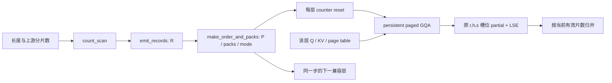

# 数据流与模块边界

本实现面向 BF16/FP16、单 token Decode、完整因果上下文 GQA。Q 头数为 KV 头数的整数倍；一个任务处理一个 KV 头对应的 Q 头组。默认示例为 Hq=32、Hkv=8、D=128、128-token tile、108 个持久 CTA。网格规模可配置，不代表每个 SM 必然常驻且仅驻留一个 CTA。

## 分片与任务索引

输入 requested_splits 来自上游；每请求 chunk 为 `ceil(ceil(L/S)/32)*32`，有效片数为 `ceil(L/chunk)`。记录是五个 int32 数组 `(request, split, begin, end, weight)`；`weight=ceil((end-begin)/128)`。空请求产生零记录。前缀和分配互不重叠的写入区间，容量按 `Bcap*Smax` 预留。

逻辑任务 `t` 还原为 `record=P[t//G]`、`group=t%G`。R 不随头组重复。桶号是权重的 ceil-log2；桶从重到轻，同桶保持原记录次序。三阶段分别启动，依赖由同一 CUDA stream 保证，不用块内屏障假装全网格屏障。

## 五条执行路径

| 路径 | 准备与领取 | 对照目的 |
|---|---|---|
| R0 | 只建 counts/offsets/chunk；执行时二分请求区间，步长轮转 | 初代紧凑路径，已删除空任务 |
| R1 | 直接记录、恒等排列，步长轮转 | 去除消费者反复搜索请求 |
| STATIC | 精确工作量降序的贪心任务列表 | 强静态对照，不能仅拿轮转衬托动态 |
| D1 | 稳定分桶，每包一个任务，scalar atomic 领取 | 动态领取增量 |
| D4 | 稳定分桶、至多四项、包总估重不超过最长任务 | 减少领取次数，保留尾部并行性 |

D4 每桶保留至少 `workers` 个单任务，不足一轮全部单项；剩余部分才整包。采用桶上界而不是平均权重决定包宽，保证所有包不超过预算。一个包内部依次调用相同 attention 计算体，不合并 softmax、不改变最终分片顺序。Triton scalar atomic 表示一个程序实例的一次逻辑领取；没有每 warp 独立取包后共用整块状态的问题。

静态基线提供两种规划器：CPU heap 的 `O(T log workers)` 实现和有界 GPU LPT 参考实现。GPU 参考使用逐项选择，复杂度较高，**不能只比较它来宣称动态优于强静态**。`bench_decode` 同时包含 CPU 方案，主机规划与上传计入完整墙钟。未来应以最快、同口径静态方案为基准。

## 分页与归并

独立入口读取 `[physical_page, token_in_page, kv_head, dim]`；所有地址使用实际 stride。SGLang 固定版本使用 page_size=1 的 CSR token 索引，适配器直接消费 `kv_indptr/kv_indices`，不展开或复制整个 KV。

计算先按当前分片 end 和请求 L 屏蔽，再查页、再加载 KV。重排只影响执行次序，写回仍用 `(request, query_head, split)`。partial 存 FP32 归一化输出，LSE 存自然对数。归并按原 split 顺序进行稳定加权；不直接平均各片输出。

counts 是计算与归并共用的有效范围。缩批后的无效槽位可以保留旧 NaN，因为归并不加载它们。独立入口将 L=0 输出定义为零；上游正常 Decode 请求应包含当前 token，实际 L>=1。设备发现无效长度／分片输入时，禁止生成任务并输出 NaN、置 error，不把截断当成功。

## Graph 与生命周期

- `DecodeGraph.update` 在 Graph 外检查主机已知容量，更新固定缓冲内容；`prepare` 录入 Graph，每次回放重新建表。
- 只读计划可供同一步 sequence order、split layout、head layout、attention window 一致的层使用。`PlanKey` 描述语义一致性，不能仅比较指针。
- KV 基地址、页映射、Q、counter、partial/LSE/output 都按层隔离。SGLang 适配器限定完整 GQA，其他层走上游。
- 每层 reset 是回放节点。两个并发执行实例必须各自持有 engine；单实例的 update/replay 用 ready/done 事件串行化。
- 返回输出是可复用缓冲的视图。外部消费者须在下一次提交前完成读取；跨流消费须自行提供依赖或复制结果。
- 均匀或未校准 AUTO 默认为 R1。模式判断在设备建表 kernel 内完成；Python 捕获时的 if 不承担运行时选择。

## 实现边界

没有重新实现模型、KV 分配器、Prefill、服务调度器或 speculative decode。SGLang 适配器继续使用上游的这些组件。FP8 KV、MLA、滑窗、logit cap 和不同 Q/KV 维度不属于优化路径。超 batch 容量在上游捕获桶／eager 选择时走原实现。重建未做资源占用、Triton 编译、输出或性能验收；这些是保留的后续验证边界。
